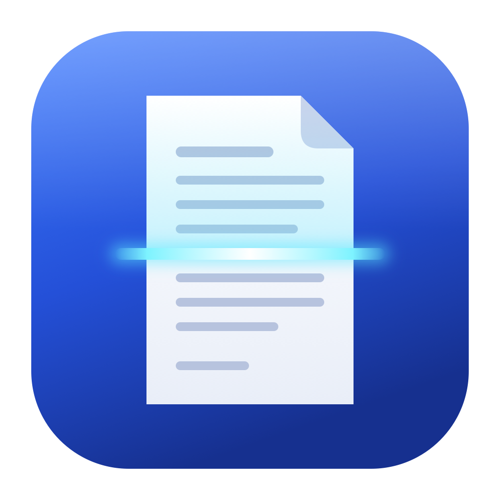

# Samsung Scan



A clean scanning app for the Mac.

Scan from the glass or the document feeder in the paper size you need. Then save your pages as a PDF or as pictures.

## What the app does

Samsung Scan lets you use the scanner of your multifunction printer from your Mac. It finds the scanner on your network by itself. It then shows only the options that your scanner has.

I built the app for the Samsung C48x series and tested it with that printer. Other scanners that the free SANE drivers support can work too.

Your scans stay on your Mac. The app sends nothing to the internet.

## What you need

1. A Mac with Apple silicon (M1 or newer) and macOS 26 or newer.
2. A scanner or multifunction printer on the same network as your Mac, or connected by USB.

You also need [Homebrew](https://brew.sh), a free tool that installs apps and drivers from the Terminal.

## Install the app

You install the app with one command in the Terminal app. You find Terminal in the Applications folder, in the Utilities folder. Homebrew also installs the free scanner drivers that the app needs.

1. If you do not have Homebrew yet, install it. Follow the instructions on [brew.sh](https://brew.sh).
2. Copy this command, paste it into Terminal, and press Return.

   ```sh
   brew install --cask michaelheichler/tap/samsung-scan
   ```

The app is now in your Applications folder. You can drag it to your Dock.

### Update the app

Run this command in Terminal. It installs the newest version.

```sh
brew upgrade --cask samsung-scan
```

### Install without Homebrew

1. Install the scanner drivers from [SANE](http://www.sane-project.org).
2. Download the ZIP file from the newest [release](https://github.com/michaelheichler/samsung-scan/releases/latest).
3. Open the ZIP file and drag Samsung Scan to your Applications folder.
4. Open the app. macOS blocks it, because Apple did not check this app.
5. Open System Settings, then Privacy & Security. Scroll down and click Open Anyway.

You do step 5 only once.

## Scan your first page

1. Open Samsung Scan.
2. When macOS asks for access to devices on your local network, click Allow. The app needs this to find your scanner.
3. Select your scanner in the list on the left.
4. Put a page on the glass, or put your pages in the document feeder.
5. On the right, choose where the paper is, the paper size, the color, and the resolution.
6. Click Scan.
7. Click Export, choose PDF, PNG, or JPEG, and save the file.

## Everything the app can do

### Scan

1. Scan from the glass or from the document feeder.
2. Scan a whole stack through the document feeder in one go. Each page appears as soon as it is done.
3. A progress bar shows how far the scan is and about how long it still takes.
4. Cancel a scan at any time. The pages that are already done stay.

### Choose what to scan

1. Pick a paper size such as A4, A5, Letter, or Legal. The list shows only the sizes that fit your scanner.
2. Make a quick preview of the glass. Then drag a frame around the part you want, for example a photo or a receipt.
3. Pick Color, Grayscale, or Black and White.
4. Pick the resolution. Low values are fast and good for text. High values take longer and are good for photos.
5. Open Advanced Options for the extra settings of your scanner.

### Arrange your pages

1. All scanned pages appear side by side, in their real paper shape.
2. Drag pages to change their order.
3. Delete the pages you do not want.
4. Press Space to see a page large.

### Save

1. Save all pages as one PDF. Each PDF page has the exact size of your paper.
2. Save each page as a PNG or JPEG picture.
3. Save only the pages you selected.
4. Drag a single page straight into a folder in Finder.

### Peace of mind

1. If you close the window, the app keeps your pages. Click the app in the Dock to get them back.
2. If you quit the app with unsaved pages, it asks first.
3. If something goes wrong, the app tells you in plain words what to do.

## How long a scan takes

These times come from a Samsung C48x with a full A4 page in color.

| Resolution | Good for | Time |
|---|---|---|
| 75 dpi | Quick previews and drafts | about 30 seconds |
| 300 dpi | Letters and documents | about 2 minutes |

A smaller paper size or a smaller frame makes the scan faster.

## When something goes wrong

| What you see | What to do |
|---|---|
| No scanner in the list | Make sure that the printer is on and in the same network as your Mac. Then click the refresh button above the list. |
| The app does not find a network scanner | Open System Settings, then Privacy & Security, then Local Network. Turn on Samsung Scan. |
| "The scanner is busy" | Another computer or app uses the scanner. Wait until it is done and try again. |
| "The scanner cover is open" | Close the cover and try again. |
| "The document feeder is empty" | Put the pages in the feeder and try again. |
| The scanner does not answer for many minutes | Switch the printer off, wait 10 seconds, and switch it on again. |

## For developers

### Build and test

```sh
./build.sh               # build and install to ~/Applications
./build.sh --no-install  # build to .build only
./test.sh                # run the checks, no scanner needed
./compile-db.sh          # update compile_commands.json for your editor
```

The build uses the Command Line Tools only, with Swift 6 and strict concurrency. The project has no third-party dependencies. The only outside tool is `scanimage` from `sane-backends`.

### Releases

1. GitHub Actions runs the checks and the build for each push to `main` and for each pull request.
2. To publish a version, push a tag such as `v1.2.0`.
3. The release workflow then builds the app with that version number and publishes a ZIP file with its SHA-256 checksum.
4. The workflow also updates the cask in [michaelheichler/homebrew-tap](https://github.com/michaelheichler/homebrew-tap). It uses the deploy key in the secret `TAP_DEPLOY_KEY`.

The app has an ad hoc signature and no Apple notarization. The cask removes the quarantine flag after the installation, so that macOS opens the app.

### How it works

1. The app runs `scanimage` from SANE for every scanner operation.
2. `scanimage -A` lists the options of the selected scanner and source. The settings panel builds its controls from this list, so the app hardcodes no scanner facts.
3. The app finds network scanners through the Bonjour service `_scanner._tcp`. It writes its own copy of the SANE `xerox_mfp.conf` with a line for each scanner it found. The copy lives in `~/Library/Application Support/de.mheichler.samsungscan/sane.d`. The app does not change the SANE files of the system.
4. `scanimage --progress` reports the progress of each page. The app reads it for the progress bar and the time estimate.
5. To cancel, the app sends a normal stop signal and waits until `scanimage` frees the scanner. A hard stop can lock some scanners for many minutes.
6. Apple Vision reads the text of each new page in the background, one page at a time. It runs on the Mac and needs no Apple Intelligence.

### Add a scanner by hand

Some scanners do not announce themselves on the network. For such a Samsung scanner, add a line with its address to the SANE file `xerox_mfp.conf`. With Homebrew, the file is `/opt/homebrew/etc/sane.d/xerox_mfp.conf`.

```
tcp 192.0.2.50
```

Then make sure that the scanner shows up with `scanimage -L`.

### Project layout

1. `Sources/ScanCore` holds the logic without any user interface. It reads scanner options, finds scanners, runs and cancels scans, matches paper sizes, and writes PDF, PNG, and JPEG files.
2. `Sources/App` holds the SwiftUI app. Its folders follow the features, namely `Shell`, `Session`, `Inspector`, `Preview`, `Pages`, and `Export`.
3. `Resources/PaperSizes.json` lists the paper sizes. If you add a size there and it fits the scanner, the app offers it.
4. `Tests` holds more than 350 checks. They use a fake `scanimage` script and recorded scanner output, so they run without a scanner.

## License

MIT. See the [LICENSE](LICENSE) file.
